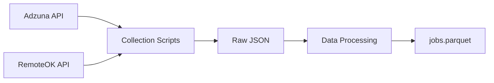
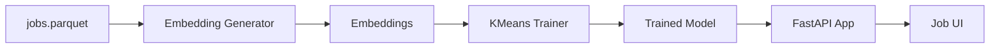
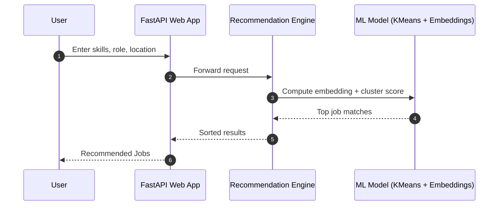

# 🚀 JobFit v2 — AI-Powered Job Recommendation System

JobFit v2 is a complete end-to-end AI system that collects real job postings, cleans & enriches them, generates embeddings, trains a custom KMeans ML model, and serves job recommendations using FastAPI.

This README contains the full setup instructions + diagrams for architecture, data flow, pipelines, and model training.

---

# 🏗️ System Architecture (High-Level)

## Data Collection & Processing Pipeline



## ML Training & Deployment Pipeline



---

# 🔄 End-to-End Pipeline Overview



---

# 📦 1. Requirements

- Python **3.11**
- Pip + virtualenv
- `.env` file in project root:

```
ADZUNA_APP_ID=your_id
ADZUNA_APP_KEY=your_key
```

---

# 💻 2. Install Dependencies

```bash
python -m venv .venv
source .venv/bin/activate
pip install -r requirements.txt
pip install -r requirements-worker.txt
```

---

# 🌍 3. Run the Web App

```bash
uvicorn webapp.app.main:app --reload
```

Your app runs at:

➡ http://127.0.0.1:8000  
➡ http://127.0.0.1:8000/job-search  
➡ http://127.0.0.1:8000/job-match  
➡ http://127.0.0.1:8000/mlops.html  

---

# 🛠️ 4. Run the Full Pipeline

## 📥 Step 1 — Collect Jobs

```bash
python scripts/run_collection_adzuna.py
python scripts/run_collection_remoteok.py
```

Produces:

```
data/raw/adzuna/
data/raw/remoteok/
```

---

## 🧹 Step 2 — Process Dataset

```bash
python scripts/run_processing.py
```

Produces:

```
data/processed/jobs.parquet
```

---

## 🧬 Step 3 — Generate Embeddings

```bash
python scripts/run_generate_embeddings.py
```

Outputs:

```
models/embeddings/all-mpnet-base-v2/jobs.npy
models/embeddings/all-mpnet-base-v2/jobs.parquet
```

---

## 🧠 Step 4 — Train Custom KMeans Model

```bash
python src/workers/model_training/train_cluster_model.py
```

Outputs:

```
models/trained/job_cluster_model_*.pkl
models/trained/job_clusters_*.parquet
```

---

# 🤖 Model Training Workflow Diagram


---

# 🎨 5. Visual Analytics Notebook (EDA)

Open:

```
notebook/eda_and_visuals.ipynb
```

It generates PNGs into:

```
notebook/figures/
```

Including:

### 🔹 Jobs by Country  
### 🔹 Jobs by Category  
### 🔹 Jobs by Source  
### 🔹 Job Age Histogram  
### 🔹 Missing Data Heatmap  
### 🔹 PCA Job Embedding Visualization  
### 🔹 Silhouette Cluster Score  
### 🔹 Cluster Size Distribution  

---

# 🚀 Deployment (Render-Ready)

Render command:

```bash
uvicorn webapp.app.main:app --host 0.0.0.0 --port $PORT
```

Make sure to include folders:

```
models/trained/
models/embeddings/
data/processed/
```

---

# 📁 Project Structure (Tree)

```plaintext
JobFit-main/
│
├── webapp/
│   └── app/main.py
│
├── scripts/
│   ├── run_collection_adzuna.py
│   ├── run_collection_remoteok.py
│   ├── run_processing.py
│   └── run_generate_embeddings.py
│
├── src/workers/
│   └── model_training/train_cluster_model.py
│
├── data/
│   ├── raw/
│   └── processed/jobs.parquet
│
├── models/
│   ├── embeddings/
│   └── trained/
│
└── notebook/
    ├── eda_and_visuals.ipynb
    └── figures/
```

---

# 🧩 Quick Troubleshooting

| Problem | Solution |
|--------|----------|
| Embeddings not loading | Re-run embedding generator |
| Model outdated | Re-run training script |
| Missing keys | Add `.env` |
| Memory high | Use `.npy` embeddings (already implemented) |
| Slow semantic search | Ensure model + embeddings preloaded |

